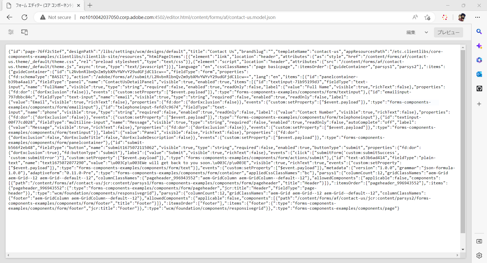

# アダプティブフォームエディターを使用したヘッドレスアダプティブフォームの作成 {#create-a-headless-adaptive-form-using-adaptive-forms-editor}

AEM Forms as a Cloud Service は、ヘッドレスアダプティブフォームを作成するための使いやすいエディターを提供しています。24 を超えるコアコンポーネントを使用できるので、エディターでコンポーネントをドラッグ＆ドロップするだけで、フォームを簡単に作成できます。また、ルールエディターを使用すると、フォームフィールドに検証を追加できます。

>[!NOTE]
>
> 
>ヘッドレスアダプティブフォームを初めて使用する場合は、ヘッドレスフォーム用のアダプティブフォームエディターを使用する前に、[スターターキットを使用したヘッドレスフォームの作成と公開](create-and-publish-a-headless-form.md)チュートリアルを実行して基本を学び、ヘッドレスアダプティブフォームを手動で作成することをお勧めします。

アダプティブフォームエディターを使用してヘッドレスアダプティブフォームを作成するには、次の手順を実行します。

## 事前準備

アダプティブフォームエディターを使用してアダプティブフォームを作成するには、以下が必要です。

**AEM 6.5 Forms の場合：**

* AEM 6.5.16.0 以降の Forms オーサーインスタンスへのアクセス

* アダプティブフォームのコアコンポーネント

* アダプティブフォームコアコンポーネントのテンプレート

* コアコンポーネントベースのテンプレート用のアダプティブフォームテーマ

* [!DNL forms-users] グループへのユーザーの追加。[!DNL forms-users] グループのメンバーには、アダプティブフォームを作成する権限があります。

**AEM Forms as a Cloud Service の場合：**

* [AEM Forms as a Cloud Service オーサーインスタンス](https://experienceleague.adobe.com/docs/experience-manager-cloud-service/content/forms/setup-configure-migrate/setup-forms-cloud-service.html)または[ローカル AEM Forms as a Cloud Service SDK](https://experienceleague.adobe.com/docs/experience-manager-cloud-service/content/forms/setup-configure-migrate/setup-local-development-environment.html?lang=ja) 環境へのアクセス

* **アダプティブフォームテンプレート**：テンプレートは基本構造を提供し、アダプティブフォームのアピアランス（レイアウトとスタイル）を定義します。これには、特定のプロパティやコンテンツ構造を有するフォーマット済みのコンポーネントが含まれます。また、テーマと送信アクションを定義するオプションも提供されます。 テーマは、ルックアンドフィールと送信アクションを定義し、アダプティブフォームの送信時に実行するアクションを定義します。 例えば、収集したデータをデータソースに送信する場合などです。 クラウドサービスでは、空白という名前の OOTB テンプレートが提供されます。

   * `blank Adaptive Forms (Core Components)` テンプレートは、すべての新しい AEM Forms as a Cloud Service プログラムに含まれています。
   * 最初から[新しいアダプティブフォーム（コアコンポーネント）テンプレートを作成する](https://experienceleague.adobe.com/docs/experience-manager-cloud-service/content/forms/adaptive-forms-authoring/authoring-adaptive-forms-foundation-components/create-an-adaptive-form-on-forms-cs/template-editor.html?lang=ja)こともできます。

* **アダプティブフォームのテーマ**：テーマには、コンポーネントとパネル向けのスタイル設定の詳細が含まれます。 スタイルには、背景カラー、ステートカラー、透明度、配置、サイズなどのプロパティが含まれます。テーマを適用すると、指定したスタイルが対応するコンポーネントに反映されます。`Canvas` テンプレートは、すべての新しい AEM Forms as a Cloud Service プログラムに含まれています。

* **権限**：[!DNL forms-users] グループにユーザーを追加します。[!DNL forms-users] グループのメンバーには、アダプティブフォームを作成する権限があります。フォーム専用のユーザーグループの詳細なリストについては、[グループと権限](https://experienceleague.adobe.com/docs/experience-manager-cloud-service/content/forms/setup-configure-migrate/forms-groups-privileges-tasks.html?lang=ja)を参照してください。

## アダプティブフォームの作成  {#create-an-adaptive-form-components}

1. [!DNL Experience Manager Forms] オーサーインスタンスにログインします。

1. Experience Manager のログインページに資格情報を入力します。ログイン後、左上隅の **[!UICONTROL Adobe Experience Manager]**／**[!UICONTROL Forms]**／**[!UICONTROL フォームとドキュメント]**&#x200B;をタップします。

1. 「**[!UICONTROL 作成]**」をタップして、「**[!UICONTROL アダプティブフォーム]**」を選択します。ウィザードが開きます。ソースタブで、テンプレートを選択します。

   

   テンプレートを選択すると、テンプレートで指定されたテーマと送信アクションが自動的に選択され、**[!UICONTROL 作成]** ボタンが有効になります。「**[!UICONTROL スタイル]**」または「**[!UICONTROL 送信]**」タブを使用して、別のテーマや送信アクションを選択することができます。 選択したテンプレートでテーマが指定されていない場合、作成ボタンは無効のままです。「**[!UICONTROL スタイル]**」タブに進み、テーマを手動で選択することができます。

1. 「**[!UICONTROL スタイル]**」タブで、テーマを選択します。

   * 選択したテンプレートでテーマを指定すると、ウィザードでテーマが自動的に選択されます。 「スタイル」タブから別のテーマを選択することもできます。

   * 選択したテンプレートにテーマが指定されていない場合は、「スタイル」タブを使用してテーマを選択することができます。 この「**[!UICONTROL 作成]**」ボタンは、テーマが選択された後にのみ有効になります。

1. （オプション）「データ」タブで、データモデルを選択します。

   * **フォームデータモデル**：[フォームデータモデル](https://experienceleague.adobe.com/docs/experience-manager-cloud-service/content/forms/integrate/use-form-data-model/data-integration.html?lang=ja)を使用すると、異なるデータソースのエンティティやサービスをアダプティブフォームに統合することができます。 作成するアダプティブフォームで、複数のデータソースに対するデータの取得と書き込みが必要になる場合は、フォームデータモデルを選択します。

   * **JSON スキーマ**：[JSON スキーマ](https://experienceleague.adobe.com/docs/experience-manager-cloud-service/content/forms/adaptive-forms-authoring/authoring-adaptive-forms-foundation-components/create-an-adaptive-form-on-forms-cs/adaptive-form-json-schema-form-model.html?lang=ja)アダプティブフォームは、生成または消費されるデータの構造を表す JSON スキーマを関連付ける機能を提供することで、所属組織のバックエンドシステムとシームレスに統合できます。この関連付けにより、作成者はスキーマの要素を使用して、アダプティブフォームにコンテンツを動的に追加できます。スキーマの要素には、オーサリングプロセス中にコンテンツブラウザーの「データモデルオブジェクト」タブから容易にアクセスでき、新しく作成されたアダプティブフォームにすべてのフィールドが自動的に追加されます。

   デフォルトでは、関連付けられた JSON スキーマのすべてのフィールドが自動的に選択され、対応するアダプティブフォームコンポーネントに変換されるので、オーサリングプロセスを合理化できます。ウィザードでは、チェックボックスを使用してアダプティブフォームに含めるフィールドを選択できる、さらに便利な機能が用意されています。

1. 「**[!UICONTROL 送信]**」タブで、送信アクションを選択します。

   * テンプレートを選択すると、テンプレートで指定された送信アクションが自動選択されます。 「送信」タブから、別の送信アクションを選択することができます。 「**[!UICONTROL 送信]**」タブには、使用可能なすべての送信アクションが表示されます。

   * 選択したテンプレートで送信アクションが指定されていない場合は、「**[!UICONTROL 送信]**」タブを使用して送信アクションを選択することができます

1. （オプション）「**[!UICONTROL 配信]**」タブで、アダプティブフォームの公開日または非公開日を指定することができます。

1. 「**[!UICONTROL 作成]**」をタップします。アダプティブフォームを保存するためのタイトル、名前および場所を指定するためのダイアログが表示されます。

   * **[!UICONTROL タイトル]**：フォームの表示名を指定します。タイトルを指定すると、[!DNL Experience Manager Forms] ユーザーインターフェイス内のフォームを特定しやすくなります。
   * **[!UICONTROL 名前：]**&#x200B;フォームの名前を指定します。指定された名前のノードがリポジトリーに作成されます。タイトルを入力し始めると、名前フィールドの値が自動的に生成されます。候補として入力された値は変更可能です。「ドキュメント名」フィールドには、英数字、ハイフン、アンダースコアのみを使用できます。無効な入力は、すべてハイフンに置き換えられます。
   * **[!UICONTROL パス]**：アダプティブフォームを保存する場所を指定します。 アダプティブフォームは、`/content/dam/formsanddocuments` に直接保存することができます。または、`/content/dam/formsanddocuments/adaptiveforms` などのフォルダーを作成して、アダプティブフォームを保存することができます。フォルダーをパスで使用する前に、必ずフォルダーを作成してください。 「**[!UICONTROL パス]**」フィールドでは、フォルダーは自動的には作成されません。

1. 「**[!UICONTROL 作成]**」をタップします。アダプティブフォームが作成され、アダプティブフォームエディターで開かれます。 エディターに、テンプレートで使用可能なコンテンツが表示されます。 アダプティブフォームのタイプに応じて、関連する <!--XFA form template, XML schema or --> JSON スキーマまたはフォームデータモデルに存在するフォーム要素が、サイドバーの&#x200B;**[!UICONTROL コンテンツブラウザ]**&#x200B;の「**[!UICONTROL データモデルオブジェクト]**」タブに表示されます。これらの要素もアドラッグ＆ドロップしてダプティブフォームを作成できます。

これで、アダプティブフォームコンポーネントをアダプティブフォームのコンテナにドラッグ＆ドロップして、フォームをデザインおよび作成できるようになりました。

## アダプティブフォームの JSON レンディションの表示 {#preview-form}

アダプティブフォームを選択し、「**プレビュー**」をタップします。フォームのプレビューが表示されます。フォームのフォーム定義（JSON）を表示するには、URLの .html 拡張子を .model.json に置き換えます。

例：http://[author-server]:[port]/editor.html/content/forms/af/contact-us.model.json

ヘッドレスアダプティブフォームの [getForm](https://opensource.adobe.com/aem-forms-af-runtime/api/#tag/Get-Form-Definition) API を使用してフォーム定義（JSON）を取得し、アプリケーションで使用できます。

