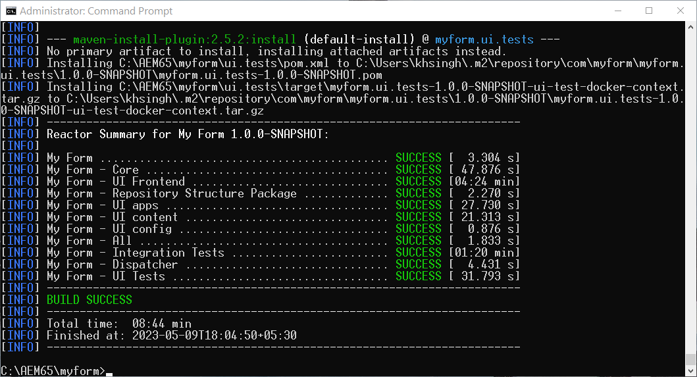

# AEM 6.5 Forms でのヘッドレスアダプティブフォームの有効化 {#enable-headless-adaptive-forms-on-aem-65-forms}

AEM 6.5 Forms 環境でヘッドレスアダプティブフォームを有効にするには、AEM アーキタイプ 41 以降をベースにしたプロジェクトをセットアップして、すべてのオーサーインスタンスとパブリッシュインスタンスにデプロイします。

AEM アーキタイプ 41 以降をベースにしたプロジェクトを AEM 6.5 Forms インスタンスにデプロイすると、[コアコンポーネントベースのアダプティブフォームを作成](create-a-headless-adaptive-form.md)できるようになります。これらのフォームは JSON 形式で表現され、ヘッドフルアダプティブフォームおよびヘッドレスアダプティブフォームとして使用されるので、モバイル、web、ネイティブアプリなどの様々なチャネルをまたいで、より柔軟に使用でき、カスタマイズが可能です。

## 前提条件 {#prerequisites}

AEM 6.5 Forms 環境でヘッドレスアダプティブフォームを有効にするには、その前に以下が必要です。

* [AEM 6.5 Forms サービスパック 16（6.5.16.0）以降にアップグレードします](https://experienceleague.adobe.com/docs/experience-manager-65/release-notes/aem-forms-current-service-pack-installation-instructions.html?lang=ja)。

* [Apache Maven](https://maven.apache.org/download.cgi) の最新リリースをインストールします。

* プレーンテキストエディターをインストールします。例えば Microsoft Visual Studio Code などです。

## 最新の AEM アーキタイプをベースにしたプロジェクトの作成とデプロイ

AEM アーキタイプ 41 [以降](https://github.com/adobe/aem-project-archetype)をベースにしたプロジェクトを作成し、すべてのオーサーインスタンスとパブリッシュインスタンスにデプロイするには：

1. AEM 6.5 Forms インスタンスをホストして実行しているコンピューターに、管理者としてログインします。
1. コマンドプロンプトまたはターミナルを開きます。
1. 次のコマンドを実行して、AEM アーキタイプ 41 ベースのプロジェクトを作成します。

   * Microsoft Windows

   ```Shell
      mvn -B org.apache.maven.plugins:maven-archetype-plugin:3.2.1:generate ^
      -D archetypeGroupId=com.adobe.aem ^
      -D archetypeArtifactId=aem-project-archetype ^
      -D archetypeVersion=41 ^
      -D appTitle="My Form" ^
      -D appId="myform" ^
      -D groupId="com.myform" ^
      -D includeFormsenrollment="y" ^
      -D aemVersion="6.5.15" 
   ```

   * Linux または Apple macOS

   ```Shell
      mvn -B org.apache.maven.plugins:maven-archetype-plugin:3.2.1:generate \
      -D archetypeGroupId=com.adobe.aem \
      -D archetypeArtifactId=aem-project-archetype \
      -D archetypeVersion=41 \
      -D appTitle="My Form" \
      -D appId="myform" \
      -D groupId="com.myform" \
      -D includeFormsenrollment="y" \
      -D aemVersion="6.5.15" 
   ```

   上記のコマンドを実行する際は、次の点を考慮してください。

   * appTitle、appId、groupId などの、環境に固有の値を反映するようにコマンドを更新します。また、includeFormsenrollment の値を &quot;y&quot; に設定します。フォームポータルを使用する場合は、_includeExamples=y_ オプションを設定して、フォームポータルのコアコンポーネントをプロジェクトに含めます。

   * 「aemVersion」を 6.5.15.0 から他のものに変更しないでください。

1. （アーキタイプバージョン 41 ベースのプロジェクトの場合のみ）AEM アーキタイププロジェクトの作成後に、コアコンポーネントベースのアダプティブフォームのテーマを有効にします。テーマを有効にするには、次の手順を実行します。

   1. [AEM Archetype Project Folder]/ui.apps/src/main/content/jcr_root/apps/__appId__/components/adaptiveForm/page/customheaderlibs.html を編集用に開きます。

   1. 21 行目に次のコードを追加します。

      ```XML
      <sly data-sly-use.clientlib="core/wcm/components/commons/v1/templates/clientlib.html"
      data-sly-use.formstructparser="com.adobe.cq.forms.core.components.models.form.FormStructureParser"
      data-sly-test.themeClientLibRef="${formstructparser.themeClientLibRefFromFormContainer}">
      <sly data-sly-test="${themeClientLibRef}" data-sly-call="${clientlib.css @ categories=themeClientLibRef}"/>
      </sly>
      ```

      

   1. ファイルを保存して閉じます。

1. 最新バージョンの Forms コアコンポーネントを含めるようにプロジェクトを更新します。

   1. [AEM Archetype Project Folder]/pom.xml を編集用に開きます。
   1. `core.forms.components.version` と `core.forms.components.af.version` のバージョンを [Forms コアコンポーネントの最新](https://github.com/adobe/aem-core-forms-components/tree/release/650)バージョンに設定します。

      

   1. ファイルを保存して閉じます。


1. AEM アーキタイププロジェクトが正常に作成されたら、環境用のデプロイメントパッケージをビルドします。パッケージをビルドするには、以下を実行します。

   1. AEM アーキタイププロジェクトのルートディレクトリに移動します。


   1. 次のコマンドを実行して、環境に対応する AEM アーキタイププロジェクトをビルドします。

      ```Shell
      mvn clean install
      ```

      


   AEM アーキタイププロジェクトが正常にビルドされると、AEM パッケージが生成されます。パッケージは、[AEM Archetype Project Folder]\all\target\[appid].all-[version].zip になります。

1. [パッケージマネージャー](https://experienceleague.adobe.com/docs/experience-manager-65/administering/contentmanagement/package-manager.html?lang=ja)を使用して、[AEM Archetype Project Folder]\all\target\[appid].all-[version].zip パッケージをすべてのオーサーインスタンスとパブリッシュインスタンスにデプロイします。

>[!NOTE]
>
>
>
>パブリッシュインスタンスのログインダイアログにアクセスして、パッケージマネージャーでパッケージをインストールできない場合は、次の URL を使用してログインしてみてください：http://[Publish Server URL]:[PORT]/system/consoleこれにより、パブリッシュインスタンスにログインして、インストールプロセスを続行できます。


お使いの環境でコアコンポーネントが有効になります。空のコアコンポーネントベースのアダプティブフォームテンプレートと Canvas 3.0 テーマが使用中の環境にデプロイされ、[コアコンポーネントベースのアダプティブフォームを作成](create-a-headless-adaptive-form.md)できるようになります。

## よくある質問

### コアコンポーネントとは

[コアコンポーネント](https://experienceleague.adobe.com/docs/experience-manager-core-components/using/introduction.html?lang=ja)は、web サイト開発時間の短縮とメンテナンスコストの削減を実現する、AEM の標準化された web コンテンツ管理（WCM）コンポーネントのセットです。

### コアコンポーネントを有効にすると、どのような機能が追加されますか？


使用中の環境でアダプティブフォームのコアコンポーネントを有効にすると、空のコアコンポーネントベースのアダプティブフォームテンプレートと Canvas 3.0 テーマが環境に追加されます。お使いの環境でアダプティブフォームのコアコンポーネントを有効にすると、次の操作を実行できます。

* コアコンポーネントベースのアダプティブフォームの作成。
* コアコンポーネントベースのアダプティブフォームテンプレートの作成。
* コアコンポーネントベースのアダプティブフォームテンプレート用のカスタムテーマの作成。
* コアコンポーネントベースのアダプティブフォームの JSON 表現を、フォームのヘッドレス表現を必要とするモバイル、web、ネイティブアプリ、サービスなどのチャネルに提供します。
