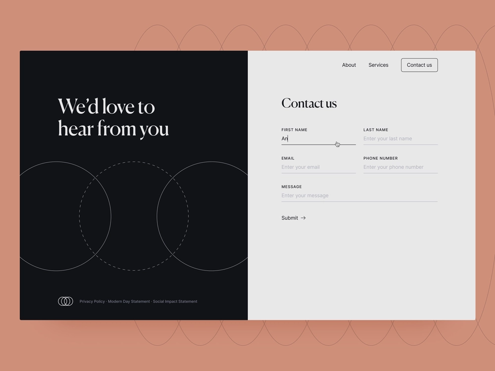

# ヘッドレスアダプティブフォームの基本を学ぶ

このチュートリアルでは、ヘッドレスアダプティブフォームを作成するためのエンドツーエンドのフレームワークについて説明します。このチュートリアルは、1 つのユースケースと複数のガイドで構成されています。各ガイドでは、このチュートリアルで作成するヘッドレスアダプティブフォームの概要と、作成したヘッドレスアダプティブフォームに新しい機能を追加する方法について説明します。すべてのガイドを完了すると、使用可能なヘッドレスアダプティブフォームができあがります。このチュートリアルを完了すると、次の操作を実行できるようになります。

* ヘッドレスアダプティブフォームの作成
* フォームへのビジネスルールの追加
* Google マテリアル UI を使用したフォームのスタイル設定
* フォームへの事前入力
* Web ページへのフォームの埋め込み

また、ヘッドレスアダプティブフォームのアーキテクチャ、使用可能なアーティファクトおよび JSON 構造についても理解を深めることができます。

**出発点：ユースケースの概要**

Raya Tan 氏は、美しい自然と豊かな観光経済で知られる国の外務省に勤務しており、観光客に対するビザ申請書の配布を監督しています。ビザ申請書は外務省の web サイト、ネイティブモバイルアプリおよび PDF 形式で入手でき、観光客が選択できる複数の言語オプションが用意されています。ただし、ビザ申請書を異なるプラットフォームやテクノロジーをまたいで管理および拡張するのは困難な場合があります。

ビザ申請プロセスの効率性と柔軟性を高めるため、外務省はヘッドレスアダプティブフォームのアプローチを採用することにしました。この分離型アーキテクチャを活用してフロントエンドをバックエンドから切り離し、より適切なカスタマイズと拡張性の向上を実現します。外務省では、デジタル署名、データ統合、ビジネスプロセス管理、記録文書、使用状況分析などのバックエンド機能を利用しながら、Google マテリアル UI の React コンポーネントを活用してフォームのユーザーエクスペリエンスを向上させる予定です。

観光客が最も頻繁に使用するフォームは「お問い合わせ」フォームで、様々な質問や問い合わせをするために使用されます。そのため、外務省はお問い合わせフォームからヘッドレスアダプティブフォームの実装を開始することにしました。このチュートリアルでは、この新しいアーキテクチャを使用してお問い合わせフォームを作成するプロセスについて順を追って説明します。最終結果は次のようになります。

