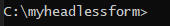
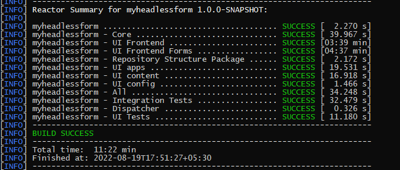
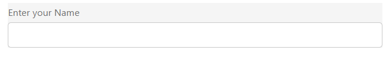
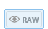
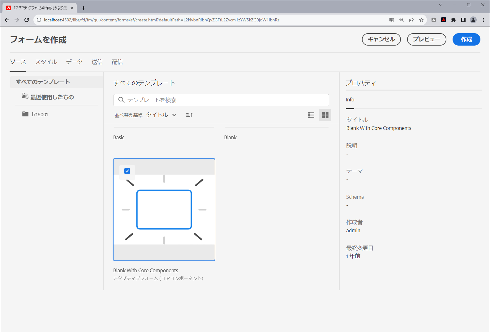

# 最初のヘッドレスアダプティブフォームを作成する

Adobe Experience Managerヘッドレスアダプティブフォームを使用すると、React などのフロントエンド UI を使用してフォームアプリケーションを作成し、Forms Web SDK を使用して、状態管理、検証、他の様々なタッチポイントとの統合などの機能を実行できます。

例えば、We.Org という組織が、顧客登録ジャーニーのデジタル化を検討しているとします。 開発者は、フロントエンドソリューションの構築にAngularを使用することに精通しています。 フォームの検証と電子署名を専用のソリューションにオフロードする際に、カスタムフロントエンドを構築しようとしています。

Adobe Experience Managerヘッドレスアダプティブフォームは、こうした組織が、既存のフロントエンド言語の専門知識を利用してフォームを自由に作成できると同時に、バックエンド機能を利用してエンタープライズクラスのフォームエクスペリエンスを作成できます。

<!-- >>[!VIDEO](https://video.tv.adobe.com/v/341011/) -->

<!--   -->

## 事前準備

* を設定します。 [開発環境](setup-development-environment.md) を使用して、ローカルマシン上でヘッドレスアダプティブフォームを作成し、テストすることができます。
* 次のソフトウェアが、ご使用のローカル開発マシンにインストールされている必要があります。
   * [Java 開発キット 11](https://experience.adobe.com/#/downloads/content/software-distribution/jp/general.html?1_group.propertyvalues.property=.%2Fjcr%3Acontent%2Fmetadata%2Fdc%3AsoftwareType&amp;1_group.propertyvalues.operation=equals&amp;1_group.propertyvalues.0_values=software-type%3Atooling&amp;fulltext=Oracle%7E+JDK%7E+11%7E&amp;orderby=%40jcr%3Acontent%2Fjcr%3AlastModified&amp;orderby.sort=desc&amp;layout=list&amp;p.offset=0&amp;p.limit=14)
   * [Git の最新リリース](https://git-scm.com/downloads). Git を初めて使用する場合は、 [Git のインストール](https://git-scm.com/book/en/v2/Getting-Started-Installing-Git).
   * [Node.js 16.13.0以降](https://nodejs.org/ja/download/). Node.js を初めて使用する場合は、 [Node.js のインストール方法](https://nodejs.dev/en/learn/how-to-install-nodejs).
   * [Maven 3.6 以降](https://maven.apache.org/download.cgi). Maven を初めて使用する場合は、 [Apache Maven のインストール](https://maven.apache.org/install.html).


## アーキタイププロジェクトを使用したヘッドレスアダプティブフォームの作成

アーキタイププロジェクトは、Maven ベースのテンプレートです。 ヘッドレスアダプティブフォームの使用を開始するためのベストプラクティスに基づいて、最小限のプロジェクトを作成します。 また、Formsas a Cloud Service環境およびローカル開発環境向けのヘッドレスアダプティブフォーム機能も含まれています。 ベータ段階では、アーキタイプ 37 以降ベースのプロジェクトを作成してデプロイする必要があります。 ベータ版以降は、プロジェクトはカスタマイズにのみ必要となります。

最初のヘッドレスアダプティブフォームを作成してレンダリングするには、次の手順を実行します。

1. [AEMアーキタイプベースのプロジェクトの作成とデプロイ](#create-an-archetype-based-project)
1. [AEM SDK へのプロジェクトのデプロイ](#deploy-the-project-to-a-local-development-environment)
1. [ヘッドレスアダプティブフォームの JSON スキーマを作成し、AEM SDK インスタンスにアップロードします。](#create-add-json-representation-of-headless-adaptive-forms)
1. [「コアコンポーネントを含む空白」テンプレートに基づいてアダプティブフォームを作成する](#create-adaptive-form-with-blank-with-core-components-template)


### 1. AEM Archetype ベースのプロジェクトを作成してデプロイする {#create-an-archetype-based-project}

オペレーティングシステムに応じて、次のコマンドを実行してExperience Manager Formsas a Cloud Serviceのプロジェクトを作成します。 アーキタイプバージョン 37 以降を使用します。 詳しくは、 [アーキタイプのドキュメント](https://experienceleague.adobe.com/docs/experience-manager-core-components/using/developing/archetype/overview.html?lang=ja) をクリックして、最新バージョンのアーキタイプを検索します。

**Microsoft Windows**

1. 管理権限でコマンドプロンプトを開きます（コマンドプロンプトまたは bash シェルを管理者として実行します）。
1. 次のコマンドを実行します。

   ```shell
     mvn -B org.apache.maven.plugins:maven-archetype-plugin:3.2.1:generate ^
     -D archetypeGroupId=com.adobe.aem ^
     -D archetypeArtifactId=aem-project-archetype ^
     -D archetypeVersion=37 ^
     -D appTitle=myheadlessform ^
     -D appId=myheadlessform ^
     -D groupId=com.myheadlessform ^
     -D includeFormsenrollment="y" ^
     -D includeFormsheadless="y" 
   ```

   * 設定 `appTitle` ：タイトルとコンポーネントグループを定義します。
   * 設定 `appId` Maven アーティファクト ID、コンポーネント、設定、コンテンツのフォルダー名、クライアントライブラリ名を定義します。
   * 設定 `groupId` :Maven グループ ID と Java ソースパッケージを定義します。
   * `includeFormsenrollment=y` オプションを使用して、アダプティブフォームの作成に必要なフォーム固有の設定、テーマ、テンプレート、コアコンポーネントおよび依存関係を含めます。
   * 以下を使用します。 `includeFormsheadless=y` ヘッドレスアダプティブForms機能を組み込むために必要なFormsコアコンポーネントと依存関係を含めるオプション。 このオプションを有効にすると、次の情報が含まれます。
      * The **コアコンポーネントを含む空白** 次のテンプレート [コアコンポーネント](https://experienceleague.adobe.com/docs/experience-manager-core-components/using/introduction.html?lang=ja).
      * フロントエンド React モジュール `ui.frontend.react.forms.af`. React アプリでヘッドレスアダプティブフォームをレンダリングするのに役立ちます。


**Apple macOSまたは Linux**:

1. ターミナルをルートユーザーとして開きます。 管理者権限を持つコマンドを実行できます。 また、 `sudo root` コマンドを実行します。
1. 次のコマンドを実行します。

   ```shell
     mvn -B org.apache.maven.plugins:maven-archetype-plugin:3.2.1:generate \
     -D archetypeGroupId=com.adobe.aem \
     -D archetypeArtifactId=aem-project-archetype \
     -D archetypeVersion=37 \
     -D appTitle=myheadlessform \
     -D appId=myheadlessform \
     -D groupId=com.myheadlessform \
     -D includeFormsenrollment="y" \
     -D includeFormsheadless="y"  
   ```

   * 設定 `appTitle` ：タイトルとコンポーネントグループを定義します。
   * 設定 `appId` Maven アーティファクト ID、コンポーネント、設定、コンテンツのフォルダー名、クライアントライブラリ名を定義します。
   * 設定 `groupId` :Maven グループ ID と Java ソースパッケージを定義します。
   * `includeFormsenrollment=y` オプションを使用して、アダプティブフォームの作成に必要なフォーム固有の設定、テーマ、テンプレート、コアコンポーネントおよび依存関係を含めます。
   * 以下を使用します。 `includeFormsheadless=y` ヘッドレスアダプティブForms機能を組み込むために必要なFormsコアコンポーネントと依存関係を含めるオプション。 このオプションを有効にすると、次の情報が含まれます。
      * The **コアコンポーネントを含む空白** 次のテンプレート [コアコンポーネント](https://experienceleague.adobe.com/docs/experience-manager-core-components/using/introduction.html?lang=ja).
      * フロントエンドは、モジュールを反応させ、 `ui.frontend.react.forms.af`. React アプリでヘッドレスアダプティブフォームをレンダリングするのに役立ちます。

コマンドが正常に完了すると、 `appID` が作成されました。 例えば、 `appID` 値と共に `myheadlessform`，フォルダー名： `myheadlessform` が作成されました。 アーキタイプベースのプロジェクトが含まれます。


### 2. AEM SDK にプロジェクトをデプロイする {#deploy-the-project-to-a-local-development-environment}

プロジェクトをAEM SDK インスタンスにデプロイすると、ヘッドレスアダプティブForms機能が追加されます。これは、 **コアコンポーネントを含む空白** テンプレート、およびプロジェクトに含まれるその他のリソースを開発環境に追加します。 <!-- Deploy the project to your local development environment to locally create Headless Adaptive Forms. or deploy directly to your Forms as a Cloud Service environment. !--> AEM SDK インスタンスにデプロイするには：

1. コマンドプロンプトを開きます。Windows を使用している場合は、管理者権限でコマンドプロンプトを開きます ( コマンドプロンプトを実行するか、 [Git bash シェル](https://khushwantsehgal.wordpress.com/2022/06/29/check-if-git-bash-is-running-in-administrator-mode/)  管理者 )。

1. 前の手順で作成したプロジェクトディレクトリに移動します。 例：`/myheadlessform`

   

1. 次のコマンドを実行します。

   ```shell
   mvn -PautoInstallPackage clean install
   ```

   「BUILD SUCCESS」メッセージが表示されるまで待ちます。
   

   依存関係の解決とプロジェクトのデプロイには時間がかかる場合があります。 プロジェクトのデプロイに失敗した場合は、 [トラブルシューティング](troubleshooting.md) 一般的な問題とその解決方法に関する記事を参照してください。


<!-- *  To learn how to deploy code to AEM as a Cloud Service, see the video in [Deploying to AEM as a Cloud Service]https://experienceleague.adobe.com/docs/experience-manager-cloud-service/content/implementing/deploying/overview.html?lang=en#coding-against-the-right-aem-version) article : -->


### 3.ヘッドレスアダプティブフォームの JSON スキーマを作成し、AEM SDK インスタンスにアップロードします {#create-add-json-representation-of-headless-adaptive-forms}

ヘッドレスアダプティブFormsは、JSON ファイルとして表されます。 サンプルフォームは、以下の場所から入手できます。 [Storybook](https://opensource.adobe.com/aem-forms-af-runtime/storybook/?path=/story/reference-examples--contact) または、アーキタイププロジェクトに含まれるサンプルフォームを次の場所で使用します。 `[Archetype Project]\ui.content\src\main\content\jcr_root\content\dam\myheadlessform\af_model_sample.json`. このドキュメントでは、 [introduction](https://opensource.adobe.com/aem-forms-af-runtime/storybook/?path=/story/reference-examples--introduction) フォームを Storybook から作成します。 これは、ヘッドレスアダプティブFormsをすばやく使い始めるのに役立つ単一のフィールドフォームです。 <!-- The [specifications](/help/assets/Headless-Adaptive-Form-Specification.pdf) document provides detailed information about various components, rules, and constraints for Headless Adaptive Forms -->

スキーマを作成してアップロードするには：

1. 拡張子を持つプレーンテキストファイルを作成する `.json`. （例：`myfirstform.json`）。ファイルシステム上、またはAEMアーキタイプベースのプロジェクト内の任意の場所で、ファイルを作成できます ( )。 `\<project-name>\ui.content\src\main\content\jcr_root\content\dam\myheadlessform\<formname>.json`
1. 次の JSON コンテンツを `.json` ファイルを作成して保存します。

   ```JSON
   {
     "adaptiveform": "0.10.0",
     "items": [
       {
         "fieldType": "text-input",
         "label": {
           "value": "Enter your Name"
         },
         "name": "textInput"
       }
     ],
     "metadata": {
       "grammar": "json-formula-1.0.0",
       "version": "1.0.0"
     }
   }
   ```

   これにより、次の 1 つのフィールドがフォームに追加されます。

   

1. にログインします。 [ローカルAEM SDK インスタンス](setup-development-environment.md#setup-author-instance)
1. Adobe Experience Manager / Forms / Formsとドキュメントに移動します。 作成／ファイルのアップロードをタップします。
1. を選択します。 `.json` 手順 2 で作成し、アップロードします。 ヘッドレスアダプティブフォームを作成する準備が整いました。 .json ファイルをAEMアーキタイプベースのプロジェクト ( ) に保存する場合は、次の場所に移動します。 `\<project-name>\ui.content\src\main\content\jcr_root\content\dam\myheadlessform\<formname>.json`. 以下を使用すると、 `mvn -PautoInstallPackage clean install` プロジェクトをAEM SDK にデプロイし、 `<formname>.json` それと一緒に

のアップロードでエラーが発生した場合、 `.json`を使用して、 [AEMアーキタイププロジェクトが正常にデプロイされました](#deploy-the-project-to-a-local-development-environment).

<!-- 1. Open the [contact form](https://opensource.adobe.com/aem-forms-af-runtime/storybook/?path=/story/reference-examples--contact) and tap the [](faq.md#storybook-example) icon on bottom-right side of the Storybook page to view the source code of the headless . 

You can use [Adaptive Forms builder extension for Visual Studio Code](/help/setup-development-environment.md#microsot-visual-studio-code-extension-for-headless-adaptive-forms) to build a JSON schema of your Headless Adaptive Forms. 

You can see [Storybook](https://opensource.adobe.com/aem-forms-af-runtime/storybook/?path=/story/reference-examples--introduction) for sample JSON schemas and list of components, attributes, and properties. You can also see the [specifications document](/help/assets/Headless-Adaptive-Form-Specification.pdf) for detailed information on all the components, constraints, and methods available to define Headless Adaptive Forms.

File extension of a JSON schema of Headless Adaptive Forms is .json. For example, formname.json. Create or add the file to your AEM Archetype based project. For example, `\myheadlessform\ui.content\src\main\content\jcr_root\content\dam\myheadlessform\home-loan.json` -> 

### 3. Deploy the project to a local development environment {#deploy-the-project-to-a-local-development-environment}

You can deploy the project to local development environment. It adds Headless Adaptive Forms functionality, the **Blank with core components** template, JSON schema of form, and other resources included in the project to your development environment. <!-- Deploy the project to your local development environment to locally create Headless Adaptive Forms. or deploy directly to your Forms as a Cloud Service environment. To deploy to your local development environment, use the following command: 

    `mvn -PautoInstallPackage clean install`

If you are on Windows, run the above with Administrative privileges (Run command prompt or [bash shell as an administrator](https://khushwantsehgal.wordpress.com/2022/06/29/check-if-git-bash-is-running-in-administrator-mode/)). For the complete list of commands, see [Building and Installing](https://experienceleague.adobe.com/docs/experience-manager-core-components/using/developing/archetype/using.html?lang=en#building-and-installing).
    
<!-- *  To learn how to deploy code to AEM as a Cloud Service, see the video in [Deploying to AEM as a Cloud Service]https://experienceleague.adobe.com/docs/experience-manager-cloud-service/content/implementing/deploying/overview.html?lang=en#coding-against-the-right-aem-version) article : -->

### 4. 「コアコンポーネントを含む空白」テンプレートに基づいてアダプティブフォームを作成する {#create-adaptive-form-with-blank-with-core-components-template}

1. にログインします。 [AEM SDK インスタンス](http://localhost:4502/).

1. Adobe Experience Manager / Forms / Formsとドキュメントに移動します。

1. 「作成」をタップして、「アダプティブフォーム」を選択します。を選択します。 **コアコンポーネントを含む空白** テンプレートを選択して「作成」をタップします。

   

1. 次のプロパティフィールドの値を指定します。 「タイトル」フィールドと「ドキュメント名」フィールドは必須です。

   * **タイトル**：フォームの表示名を指定します。 タイトルを指定すると、Experience Manager Formsユーザーインターフェイス内のフォームを識別しやすくなります。
   * **名前**：フォームの名前を指定します。 指定された名前のノードがリポジトリーに作成されます。タイトルを入力し始めると、名前フィールドの値が自動的に生成されます。候補として入力された値は変更可能です。「ドキュメント名」フィールドには、英数字、ハイフン、アンダースコアのみを使用できます。無効な入力は、すべてハイフンに置き換えられます。

1. 「作成」をタップします。アダプティブフォームが作成されます。

次の項目が表示されない場合、 **コアコンポーネントを含む空白** テンプレートを作成する場合は、 [AEMアーキタイププロジェクトが正常にデプロイされました](#deploy-the-project-to-a-local-development-environment).

### 5. JSON スキーマを使用するようにアダプティブフォームを設定する {#configure-adaptive-form-to-use-the-JSON-representation}

前の手順で作成したアダプティブフォームは空白です。 JSON スキーマを使用するようにアダプティブフォームを設定します。

1. にログインします。 [AEM SDK インスタンス](http://localhost:4502/).

1. Adobe Experience Manager / Forms / Formsとドキュメントに移動します。 前の手順で作成したアダプティブフォームを選択して「編集」をタップします。 エディターでアダプティブフォームが開きます。

1. アダプティブFormsコンテナコンポーネントをタップし、「プロパティ」をタップします。 サイドバーにプロパティエクスプローラーが表示されます。

1. プロパティエクスプローラーで、「 BASIC 」アコーディオンを展開し、前の手順でアップロードした JSON スキーマのパスを「 Forms Runtime ドキュメントのパス」オプションに指定します。 コンテナコンポーネントは、フォームのレンディションを表示します。

1. プロパティエクスプローラーで、「 SUBMISSION 」アコーディオンを展開し、アダプティブフォームの「送信アクション」を設定します。 これで、React アプリでフォームを使用する準備が整いました。

1. フォームをレンダリングするには、ローカル開発マシンでホストします。

   1. を開きます。 `[Archetype project]\ui.frontend.react.forms.af\.env` ファイルを作成し、フォームのパスを設定します。 例： /content/forms/af/contact

   1. コマンドプロンプトを開き、 ui.frontend.react.forms.af プロジェクトに移動して、次のコマンドを実行します。

      `npm run start`

   1. 完了したら、ブラウザーウィンドウで localhost:3000 を開き、レンダリングされたヘッドレスアダプティブフォームを表示します。
   1. 送信機能をテストするには、AEM Formsサーバーにログインし、 **フォームをHTMLでプレビュー** オプションを使用して、フォームをプレビューモードで開くことができます。

The [Storybook](https://opensource.adobe.com/aem-forms-af-runtime/storybook/) では、様々なヘッドレスアダプティブFormsで設定できるコンポーネントとルールのリストと、ヘッドレスアダプティブFormsの JSON スキーマの例を示します。 また、 [仕様](/help/assets/Headless-Adaptive-Form-Specification.pdf) ヘッドレスアダプティブFormsに関する様々なルールとプロパティについて説明するドキュメントです。
