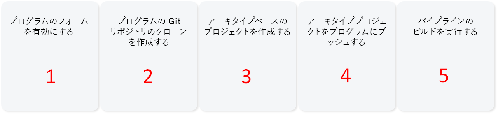
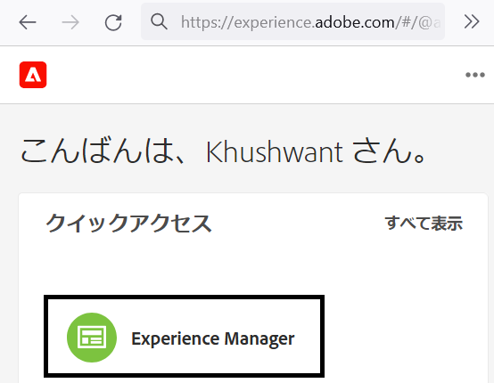
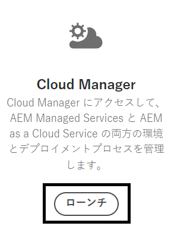
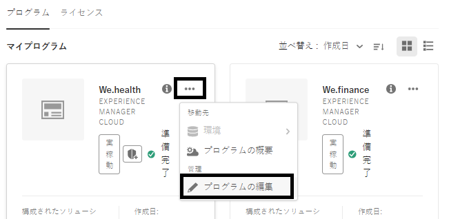
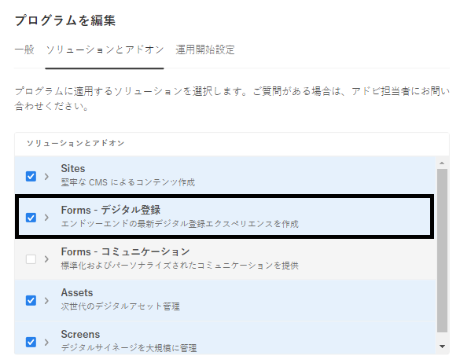
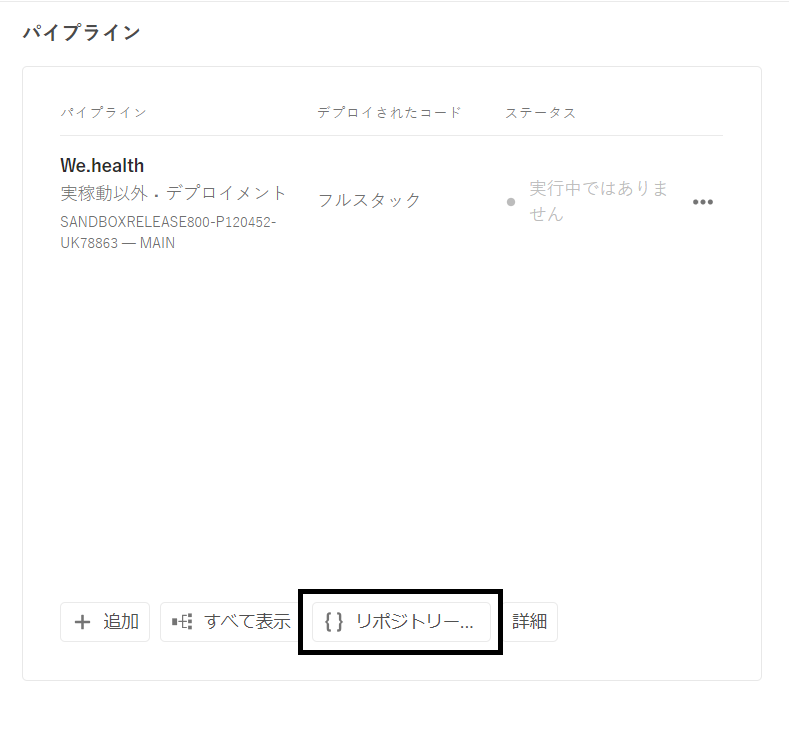
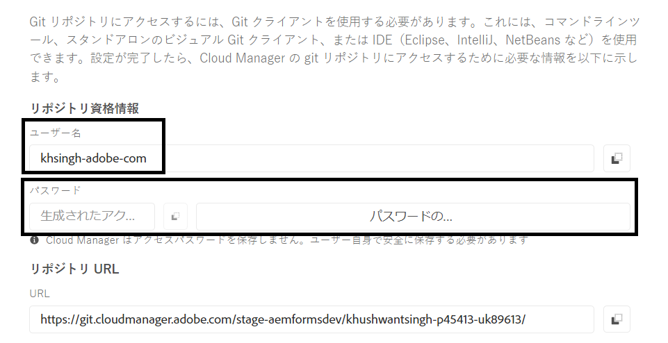
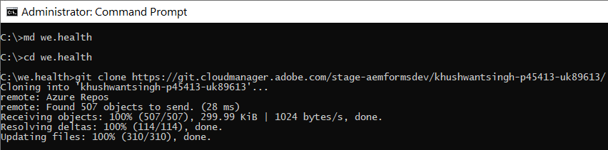
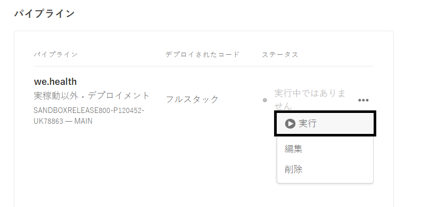

# Cloud Service上のヘッドレスアダプティブフォームの開発環境の設定

<span class="preview"> これは、 **作業中** 記事。</span>


Cloud Service上でヘッドレスアダプティブフォームの作成とテストを行う準備はできていますか？ FormsをCloud Serviceプログラムに対して有効にし、開始します。

## 始める前に

* インストール [Git の最新バージョン](https://git-scm.com/downloads) ローカルマシン上にある。 Git を初めて使用する場合は、 [Git のインストール](https://git-scm.com/book/en/v2/Getting-Started-Installing-Git). Git リポジトリを使用して、開発環境で開発されたフォームおよびカスタムコードを、ローカル開発開発環境にプッシュします。Cloud Service

* インストール [Node.js 16.13.0以降](https://nodejs.org/ja/download/) ローカルマシン上にある。 Node.js を初めて使用する場合は、 [Node.js のインストール方法](https://nodejs.dev/en/learn/how-to-install-nodejs).

* AEMas a Cloud Serviceプログラムの作成： [プログラムを作成](https://experienceleague.adobe.com/docs/experience-manager-cloud-service/content/onboarding/demo-add-on/create-program.html?#create-program) 記事を参照して、組織のプログラムを作成してください。

* 有効にする [チャネルプログラムのプレリリースCloud Service](https://experienceleague.adobe.com/docs/experience-manager-cloud-service/content/release-notes/prerelease.html?cloud-environments).

## ワークフローを設定

Formsas a Cloud Serviceサンドボックスでヘッドレスアダプティブフォームを有効にするには、を有効にします。 `Forms - Digital enrolment` AEM Cloud Serviceプログラムのソリューション、ローカルマシン上に Archetype 37 以降ベースのプロジェクトを作成し、Forms as a Cloud Service環境にプッシュします。 完全なプロセスは次のとおりです。



### 1.プログラムに対してFormsを有効にする

<table style="table-layout:auto">
<tr>
  <td>
  1.にログインする <a href="https://experience.adobe.com/" > https://experience.adobe.com/ </a>  をクリックし、 <b> Experience Manager </b> オプション。
  </td>
  <td>
    <a href="https://experienceleague.adobe.com/docs/experience-manager-cloud-service/content/onboarding/demo-add-on/create-program.html?#create-program">
      
    </a>
    <br>
  </td>
</tr>
<tr>
  <td>
  2. <b> Cloud Manager </b> オプション、クリック <b> を起動します。 </b> 組織のプログラムのリストが表示されます。
  </td>
  <td>
    <a href="https://experienceleague.adobe.com/docs/experience-manager-cloud-service/content/onboarding/demo-add-on/create-program.html?#create-program">
      
    </a>
    <br>
  </td>
</tr>
<tr>
  <td>
    3.プログラムの場合、...アイコンをタップし、 <b> プログラムを編集 </b> オプション。 ダイアログボックスが表示されます。 
  </td>
  <td>
    <a href="https://experienceleague.adobe.com/docs/experience-manager-cloud-service/content/onboarding/demo-add-on/create-program.html?#create-program">
      
    </a>
    <br>
  </td>
</tr>
<tr>
  <td>
    4. [ プログラムの編集 ] ダイアログボックスで、 <b> 「ソリューションとアドオン」タブ </b>を選択し、 <b> Forms — デジタル登録 </b> オプションを選択し、をタップします。 <b> 更新 </b>. 
  </td>
  <td>
    <a href="https://experienceleague.adobe.com/docs/experience-manager-cloud-service/content/onboarding/demo-add-on/create-program.html?#create-program">
      
    </a>
    <br>
  </td>
</tr>
</table>

### 2.プログラムの Git リポジトリをローカルマシンに複製する

すべてのAEMas a Cloud Serviceプログラムには Git リポジトリがあります。 カスタムコードやアセットをローカルマシンからCloud Service環境にアップロードできます。 セットアップ時には、Git リポジトリを使用して、ヘッドレスアダプティブフォーム関連のコード、テンプレート、その他の情報をローカルマシンからCloud Serviceプログラムに取り込みます。 ローカルマシン上のCloud Servicegit リポジトリーのクローンを作成することは、カスタムコードとコンテンツをローカルマシンからCloud Serviceに移行する最初の手順です。

>[!INFO]
>
> Git リポジトリは、複製せずに常にコミットできます。 しかし、それは独自の奇妙なものを持っています。 この文書ではクローニングの手法を使っています


リポジトリのクローンを作成するには、次を手順を実行します。

<table style="table-layout:fixed">
<tr>
  <td>
  1.プログラムのパイプラインボックスで、をタップします。 <b> リポジトリ情報にアクセスします。 </b> リポジトリ情報を含むダイアログが表示されます 
  </td>
  <td>
    <a href="https://experienceleague.adobe.com/docs/experience-manager-cloud-service/content/onboarding/demo-add-on/create-program.html?#create-program">
      
    </a>
    <br>
  </td>
</tr>
<tr>
  <td>
  2.をタップします。 <b> パスワードを生成 </b> をクリックし、 <b> リポジトリ URL。 </b> 
  </td>
  <td>
      
    <br>
  </td>
</tr>
<tr>
  <td>
    3.ローカルマシン上で、コマンドプロンプトを開き、フォルダーを作成して、次のコマンドを実行し、リポジトリの資格情報を指定します。次のように求められます。
    </br>
    <code> git clone [Repository URL] </code> </br></br>
    例： </br> 
    <code> git clone https://git.cloudmanager.adobe.com/stage-aemformsdev/khushwantsingh-p45413-uk89613/ </code>

</br> 尋ねられたら、 <b> ユーザー名</b> および <b>パスワード</b> から <b>リポジトリ情報</b> 画面。
</td>
  <td>
     
  </td>
</tr>
</table>


### 3. AEMアーキタイプベースのプロジェクトを作成する

アーキタイププロジェクトは、Maven ベースのテンプレートです。 ヘッドレスアダプティブフォームの使用を開始するためのベストプラクティスに基づいて、最小限のプロジェクトを作成します。 また、Formsas a Cloud Service用のヘッドレスアダプティブフォームのコア機能も含まれています。 アーキタイプ 37 以降ベースのプロジェクトの作成とデプロイが必須です。
®®(R) オペレーティングシステムに応じて、maven コマンドを実行してExperience Manager Formsas a Cloud Serviceプロジェクトを作成します。 アーキタイプバージョン 37 以降を使用します。 詳しくは、 [アーキタイプのドキュメント](https://experienceleague.adobe.com/docs/experience-manager-core-components/using/developing/archetype/overview.html?lang=ja) をクリックして、最新バージョンのアーキタイプを検索します。

+++ Microsoft® Windows

1. 管理者権限でコマンドプロンプトを開きます（コマンドプロンプトまたは bash シェルを管理者として実行します）。
1. 次のコマンドを実行します。

   ```shell
     mvn -B org.apache.maven.plugins:maven-archetype-plugin:3.2.1:generate ^
     -D archetypeGroupId=com.adobe.aem ^
     -D archetypeArtifactId=aem-project-archetype ^
     -D archetypeVersion=37 ^
     -D appTitle=myheadlessform ^
     -D appId=myheadlessform ^
     -D groupId=com.myheadlessform ^
     -D includeFormsenrollment="y" ^
     -D includeFormsheadless="y" 
   ```

™™™ *設定 `appTitle` ：タイトルとコンポーネントグループを定義します。
*設定 `appId` Maven アーティファクト ID、コンポーネント、設定、コンテンツのフォルダー名、クライアントライブラリ名を定義します。
*設定 `groupId` :Maven groupId と Java™ソースパッケージを定義します。
* `includeFormsenrollment=y` アダプティブFormsの作成に必要なForms固有の設定、テーマ、テンプレート、コアコンポーネント、依存関係を含めるオプションが追加されました。
* `includeFormsheadless=y` ヘッドレスアダプティブフォーム機能を組み込むために必要なFormsコアコンポーネントと依存関係を含めるオプション。 このオプションを有効にすると、次の情報が含まれます。\
* **コアコンポーネントを含む空白** 次のテンプレート [コアコンポーネント](https://experienceleague.adobe.com/docs/experience-manager-core-components/using/introduction.html?lang=ja).
*フロントエンド React モジュール `ui.frontend.react.forms.af`. React アプリでヘッドレスアダプティブフォームをレンダリングするのに役立ちます。

+++®®


+++ Apple macOSまたは Linux®

1. ターミナルをルートユーザーとして開きます。 管理者権限を持つコマンドを実行できます。 また、 `sudo root` コマンドを実行します。
1. 次のコマンドを実行します。

   ```shell
     mvn -B org.apache.maven.plugins:maven-archetype-plugin:3.2.1:generate \
     -D archetypeGroupId=com.adobe.aem \
     -D archetypeArtifactId=aem-project-archetype \
     -D archetypeVersion=37 \
     -D appTitle=myheadlessform \
     -D appId=myheadlessform \
     -D groupId=com.myheadlessform \
     -D includeFormsenrollment="y" \
     -D includeFormsheadless="y"  
   ```

™™™ *設定 `appTitle` ：タイトルとコンポーネントグループを定義します。
*設定 `appId` Maven アーティファクト ID、コンポーネント、設定、コンテンツのフォルダー名、クライアントライブラリ名を定義します。
*設定 `groupId` :Maven groupId と Java™ソースパッケージを定義します。
* `includeFormsenrollment=y` アダプティブFormsの作成に必要なForms固有の設定、テーマ、テンプレート、コアコンポーネント、依存関係を含めるオプションが追加されました。
* `includeFormsheadless=y` ヘッドレスアダプティブフォーム機能を組み込むために必要なFormsコアコンポーネントと依存関係を含めるオプション。 このオプションを有効にすると、次の情報が含まれます。\
* **コアコンポーネントを含む空白** 次のテンプレート [コアコンポーネント](https://experienceleague.adobe.com/docs/experience-manager-core-components/using/introduction.html?lang=ja).
*フロントエンドはモジュールを反応させ、 `ui.frontend.react.forms.af`. React アプリでヘッドレスアダプティブフォームをレンダリングするのに役立ちます。

+++

コマンドが正常に完了すると、 `appID` が作成されました。 例えば、 `appID` 値と共に `myheadlessform`，フォルダー名： `myheadlessform` が作成されました。 アーキタイプベースのプロジェクトが含まれます。

### 4. AEMアーキタイプベースのプロジェクトをCloud Service環境にプッシュします

1. Git リポジトリのコンテンツを、アーキタイプベースのプロジェクトのコンテンツで置き換えます。

   >[!VIDEO](https://video.tv.adobe.com/v/3409809/)

1. コマンドプロンプトを開き、Git リポジトリフォルダーに移動し、次のコマンドをリストの順序で実行して、置き換えたコンテンツをCloud Service環境にアップロードします。 次のコマンドを使用する代わりに、ビジュアルエディターを使用して、コンテンツをCloud Serviceリポジトリにプッシュすることもできます。

   ```
      git add .
      git commit
      git push origin
   ```

### 5.プログラムのビルドパイプラインを実行します


<table style="table-layout:auto">
<tr>
  <td>
  1.にログインする <a href="https://experience.adobe.com/" > https://experience.adobe.com/ </a>  をクリックし、 <b> Experience Manager </b> オプション。
  </td>
  <td>
    <a href="https://experienceleague.adobe.com/docs/experience-manager-cloud-service/content/onboarding/demo-add-on/create-program.html?#create-program">
      
    </a>
    <br>
  </td>
</tr>
<tr>
  <td>
  2. <b> Cloud Manager </b> オプション、クリック <b> を起動します。 </b> 組織のプログラムのリストが表示されます。 プログラムを開きます。 
  </td>
  <td>
    <a href="https://experienceleague.adobe.com/docs/experience-manager-cloud-service/content/onboarding/demo-add-on/create-program.html?#create-program">
      
    </a>
    <br>
  </td>
</tr>
<tr>
  <td>
    3.パイプラインの場合、...アイコンをタップし、 <b> 実行 </b> オプション。 パイプラインを実行するように求められた場合は、をタップします。 <b> 実行 </b> パイプラインを待つ <b> ステータス </b>  に変わる <b> 完了 </b>.  
  </td>
  <td>
    <a href="https://experienceleague.adobe.com/docs/experience-manager-cloud-service/content/onboarding/demo-add-on/create-program.html?#create-program">
      
    </a>
    <br>
  </td>
</tr>
</table>

これで、ヘッドレスアダプティブフォームを使用する準備が整いました。 これで、フォームの JSON 定義をCloud Service環境にアップロードし、それに基づいてヘッドレスアダプティブフォームを作成し、 [getForm](https://opensource.adobe.com/aem-forms-af-runtime/api/#tag/Get-Form-Definition/operation/getForm) アプリケーションまたはサービスでヘッドレスアダプティブフォームを使用するための他の rest API も用意されています。
