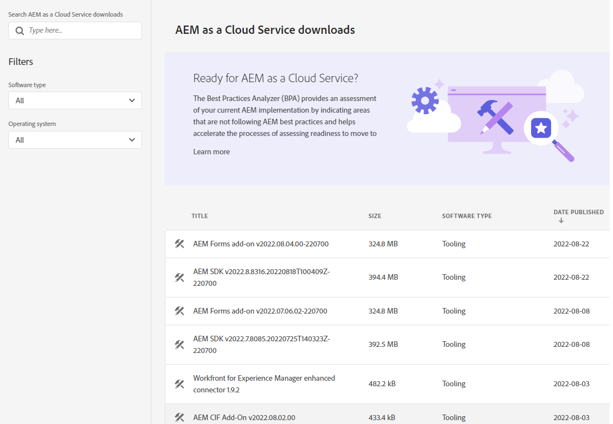
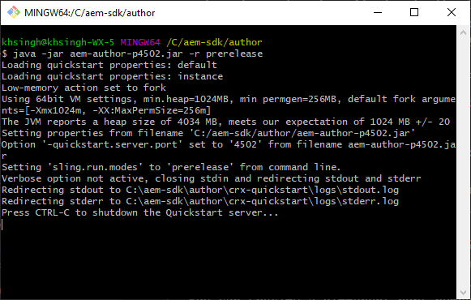

# ローカル開発環境のセットアップ {#headless-adaptive-forms-setup-development-environment}

ローカル開発環境をセットアップして、ローカルマシン上でヘッドレスアダプティブフォームを作成およびテストできます。開発環境は、AEM SDK と、AEM SDK にインストールされた AEM Forms 機能アーカイブで構成されます。
<!--
 After a Headless adaptive form or related assets are ready on the local development environment, you can deploy the Headless adaptive form application to your publishing environment. -- >

You require knowledge to build application using react, Git, and Maven to use Headless adaptive forms.

<!-- 

### Download the latest version of AEM as a Cloud Service SDK or Forms feature archive (AEM Forms add-on) from Software Distribution {#software-distribution}

To download the supported version of Adobe Experience Manager as a Cloud Service SDK or Forms feature archive (AEM Forms add-on):

1. Log in to [Software Distribution](https://experience.adobe.com/#/downloads) portal with your Adobe ID.

    >[!NOTE]
    >
    > Your Adobe Organization must be provisioned for AEM as a Cloud Service to download the AEM as a Cloud Service SDK.

1. Navigate to the **[!UICONTROL AEM as a Cloud Service]** tab.
1. Sort by published date in descending order.
1. Click on the latest Adobe Experience Manager as a Cloud Service SDK or Forms feature archive (AEM Forms add-on).
1. Review and accept the EULA. Tap the **[!UICONTROL Download]** button. -->

## 必要システム構成 {#headless-adaptive-forms-system-requirements}

AEM SDK をインストールするには、ローカルマシンが次の最小要件を満たしている必要があります。

* [Java Development Kit 11](https://experience.adobe.com/#/downloads/content/software-distribution/jp/general.html?1_group.propertyvalues.property=.%2Fjcr%3Acontent%2Fmetadata%2Fdc%3AsoftwareType&amp;1_group.propertyvalues.operation=equals&amp;1_group.propertyvalues.0_values=software-type%3Atooling&amp;fulltext=Oracle%7E+JDK%7E+11%7E&amp;orderby=%40jcr%3Acontent%2Fjcr%3AlastModified&amp;orderby.sort=desc&amp;layout=list&amp;p.offset=0&amp;p.limit=14)
* [Git の最新リリース](https://git-scm.com/downloads)。Git を初めて使用する場合は、[Getting Started - Installing Git](https://git-scm.com/book/en/v2/Getting-Started-Installing-Git) を参照してください。
* [Node.js 16.13.0 以降](https://nodejs.org/ja/download/)。Node.js を初めて使用する場合は、[How to install Node.js](https://nodejs.dev/en/learn/how-to-install-nodejs) を参照してください。
* [Maven 3.6 以降](https://maven.apache.org/download.cgi)。Maven を初めて使用する場合は、[Installing Apache Maven](https://maven.apache.org/install.html) を参照してください。

## 開発環境のセットアップ {#headless-adaptive-forms-procedure-to-setup-development-environment}

新しいローカル開発環境をセットアップし、その環境を使用してヘッドレスアダプティブフォームを開発およびテストするには、次の手順を実行します。

1. [AEM as a Cloud Service SDK をセットアップします](#setup-author-instance)。
1. [AEM Forms アーカイブ（AEM Forms Cloud Service アドオン）を AEM SDK に追加します](#add-forms-archive)。

<!--

1. (Optional) [Add Forms-specific users to your local Author instance](#configure-users-and-permissions).
1. (Optional) Install [Adaptive forms builder extension for Microsoft Visual Studio Code](#microsoft-visual-studio-code-extension-for-headless-adaptive-forms). 

-->

### 1. AEM as a Cloud Service SDK のセットアップ {#setup-author-instance}

AEM as a Cloud Service SDK（AEM SDK）は、ヘッドレスアダプティブフォームを作成およびテストするためのローカルエクスペリエンスを開発者に提供します。AEM as a Cloud Service SDK はヘッドレスアダプティブフォームの作成とプレビューの両方に使用できるので、開発に関連するほとんどの検証をローカルで実行できるようになります。ローカルのオーサーインスタンスをセットアップするには、次の手順を実行します。

1. 最新の [!DNL Adobe Experience Manager] as a Cloud Service SDK を[ダウンロード](https://experience.adobe.com/#/downloads/content/software-distribution/jp/aemcloud.html)します。「公開日」列を使用すると、ファイルを並べ替えて最新の SDK を簡単に見つけることができます。
SDK は .zip 形式です。サポートされているバージョンは、aem-sdk-2022.7.8085.20220725T140323Z-220700.zip 以降です。

   


1. ダウンロードした .zip ファイルをローカルマシン上のディレクトリに展開します。
1. オーサーインスタンスのインストール場所となるディレクトリをローカルマシン上に作成します。例えば `~/aem-sdk/author` などです。
1. 抽出した SDK ファイルから .jar ファイルをインストール場所にコピーし、ファイルの名前を `aem-author-p4502.jar` に変更します。ファイル名の `p4502` 文字列には、使用するポート番号を指定します。別のポート番号を指定することもできます。

   >[!NOTE]
   >
   > .jar ファイルをダブルクリックして起動しないでください。[エラー](https://experienceleague.adobe.com/docs/experience-manager-learn/cloud-service/local-development-environment-set-up/aem-runtime.html?lang=ja#troubleshooting-double-click)が発生します。

1. コマンドプロンプトを開きます。
   * Windows の場合、「**管理者として実行**」オプションを使用して、管理者特権モードでコマンドプロンプトを開きます。
   * Linux の場合、必ず root ユーザーとしてターミナルウィンドウを開きます。

1. コピーした.jar ファイルを含んだインストール場所に移動し、次のコマンドを実行します。

   `java -jar aem-author-p4502.jar -r prerelease`

   

   * `-r prerelease` スイッチを使用すると、プレリリースプログラムおよび限定的なリリースプログラムでのみ利用可能な機能を有効化できます。
   * 認知的負荷を軽減するために、ローカル開発のユーザー名とパスワードとして `admin` を使用できます。

   AEM を起動すると、ログインページが web ブラウザーに開きます。また、アドレス `http://localhost:<port>` にある AEM SDK インスタンスのログインページを web ブラウザーで開くこともできます。例えば [http://localhost:4502](http://localhost:4502) などのアドレスです。

1. オーサーインスタンスにログインします。アイコン、「Adobe Experience Manager について」の順にタップして、バージョン番号の後に PRERELEASE と表示されていることを確認します。

   

番号の後に PRERELEASE と表示されていない場合は、サーバーを停止して `[AEM SDK installation]/crx-quickstart folder` を削除し、`-r prerelease` スイッチを付けて AEM SDK の .jar ファイルを再起動します。その他のオプションについては、[トラブルシューティング](/help/troubleshooting.md)を参照してください。

### 2. AEM SDK への AEM Forms アーカイブ（AEM Forms Cloud Service アドオン）の追加 {#add-forms-archive}

AEM Forms as a Cloud Service 機能アーカイブ（AEM Forms Cloud Service アドオン）には、ローカル開発環境でヘッドレスアダプティブフォームを作成するためのツールが用意されています。機能アーカイブをインストールするには、次の手順を実行します。

1. 最新の [!DNL AEM Forms] 機能アーカイブ（AEM Forms アドオン）を[ソフトウェア配布](https://experience.adobe.com/#/downloads/content/software-distribution/en/aemcloud.html?fulltext=AEM*+Forms*+add*+on*&amp;orderby=%40jcr%3Acontent%2Fjcr%3AlastModified&amp;orderby.sort=desc&amp;layout=list&amp;p.offset=0&amp;p.limit=20)からダウンロードして展開します。「公開日」列を使用すると、ファイルを並べ替えて最新の SDK を簡単に見つけることができます。サポートされているバージョンは、aem-forms-addon-2022.07.06.02-220600 以降です。

1. crx-quickstart/install ディレクトリに移動します。フォルダーが存在しない場合は作成します。
1. AEM SDK インスタンスを停止します。AEM SDK インスタンスを実行しているコマンドプロンプトウィンドウを終了すると、AEM を停止できます。
1. 手順 1 で展開した [!DNL AEM Forms] アドオン機能アーカイブをファイル `aem-forms-addon-<version>.far` からインストールフォルダーにコピーします。
1. 次のコマンドを使用して、AEM SDK インスタンスを再起動します。

   `java -jar aem-author-p4502.jar -r prerelease`

<!-- 

### 3. (Optional) Configure users and permissions {#configure-users-and-permissions}

Create seperate user accounts for Form Developer, Form Practitioner, and end users. These account help you test Headless adaptive forms for various types of users. To create a user account and add roles to the account:

1. Login to your AEM SDK instance.
1. Go to Tools > Security > Users and tap Create. The Create New User wizard opens.
1. In the details tab, specify an ID and Password. All other fields are optional. It is recommended to provide name and an email address.
1. In the Groups tab, search and select user-groups for a user depending on their role. The table below lists all types of users and pre-defined groups for each type of forms users based on their role:
  
    | User Type | AEM Group |
    |---|---|
    | Form developer | [!DNL forms-users] (AEM Forms Users), [!DNL template-authors], [!DNL workflow-users], [!DNL workflow-editors], and [!DNL fdm-authors]  |
    | Customer Experience Lead or UX Designer| [!DNL forms-users], [!DNL template-authors]|
    | AEM administrator | [!DNL aem-administrators], [!DNL fd-administrators] |
    | End user| When a user must log in to view and submit an Adaptive Form, add such users to [!DNL forms-users] group. </br> When no user authentication is required to access Adaptive Forms, do not assign any group to such users.|

<!-- ### 4. (Optional) Install Visual Studio Code extension for Headless adaptive forms {#microsoft-visual-studio-code-extension-for-headless-adaptive-forms}

You can use any IDE for developing Headless adaptive forms. Adobe provides an extension for Microsoft&reg;reg; Visual Studio Code to make it easier for you to navigate structure and develop Headless adaptive forms. The extension adds adaptive forms related IntelliSense capabilities and helps auto-complete Headless adaptive forms JSON syntax. It also adds a panel, titled Forms Tree, to help navigate structure of Headless adaptive form. To use the extension: 

1. Ensure [Microsoft Visual Studio Code 1.62.0 or later](https://code.visualstudio.com/docs/supporting/FAQ#_how-do-i-find-the-version) is installed. If you have an older version or no version installed, download the latest version from [Microsoft Website](https://code.visualstudio.com/docs/setup/setup-overview)
   >[!NOTE]
   >
   >
   > To use Visual Studio from command line on macOS, see [Launching from the command line](https://code.visualstudio.com/docs/setup/mac#_launching-from-the-command-line).

1. Download the [Adaptive forms builder extension](/help/assets/adaptive-form-builder-0.12.0.vsix).

1. Navigate the directory containing the *adaptive-form-builder-[version].vsix* file.

1. Run the following command or see [Install from a VSIX](https://code.visualstudio.com/docs/editor/extension-marketplace#_install-from-a-vsix) article for detailed instructions to install a Visual Studio Code extension from a VSIX file:

    `code -–install-extension adaptive-form-builder-[version].vsix`

    </br> Replace the [version] with actual version of the extension. For example, `code -–install-extension adaptive-form-builder-0.12.0.vsix`

    </br> 

    

<!-- ## Create and setup a react app

Adaptive forms renderer component is a react based component. It requires a react app to run and render a Headless adaptive form. To create and setup react app:

1. Open terminal in Visual Studio code and run the following command to create a react app and installs all related dependencies:

    ```shell
    npx create-react-app [react-app-name] --scripts-version 4.0.3 --template typescript
    ```

    Where [react-app-name] represents name of the project, script version is 4.0.3, and template of type typescript. For example, the following command creates a react app named *headless-forms-demo*.

    ```shell
    npx create-react-app headless-forms-demo --scripts-version 4.0.3 --template typescript
    ```

    It may take some time to create the react app and install all the dependencies. The command creates an empty react app with latest version of react and react-dom dependencies. It does not have any artifacts related to adaptive forms renderer component.

1. Adaptive forms renderer component is based on react spectrum and requires react 16.0.0 and react-dom 16.0.0. To install react 16.0.0 and related dependencies:
    1. Open the Visual Studio code terminal Window or command prompt.
    1. Navigate to the directory of react project.  
    1. Run the following command:

        ```shell
        npm install --save react@16.0.0 react-dom@16.14.0 -force
        ```

1. Run the following command to install adaptive forms renderer component related dependencies:

    ```shell
    npm i --save @aemforms/forms-super-component @aemforms/forms-react-core-components @aemforms/forms-super-component @adobe/react-spectrum @react/react-spectrum
    ```

<!-- 1. Install dependencies for adaptive forms renderer component. Packages for these dependencies are available in Adobe Artifactory. To authenticate with Adobe Artifactory and install dependencies for adaptive forms renderer component:

    1. Create environment variables ARTIFACTORY_USER and ARTIFACTORY_API_TOKEN. The ARTIFACTORY_USER stores Adobe LDAP username and ARTIFACTORY_API_TOKEN stores your [Adobe Artifactory token](https://wiki.corp.adobe.com/display/Artifactory/API+Keys)

    1. Run the following command to set NPM_TOKEN and NPM_EMAIL tokens:

        ```shell

        auth=$(curl -s -u${ARTIFACTORY_USER}:${ARTIFACTORY_API_TOKEN} https://artifactory.corp.adobe.com/artifactory/api/npm/auth)
        export NPM_TOKEN=$(echo "${auth}" | grep "_auth" | awk -F " " '{ print $3 }')
        export NPM_EMAIL=$(echo "${auth}" | grep "email" | awk -F " " '{ print $3 }')
        ```

        These tokens are required to communicated with Adobe Artifactory.

    1. Create a .npmrc file in the react project.

        

    1. Add the following code to the file:

        ```shell
        @aemforms:registry=https://artifactory.corp.adobe.com/artifactory/api/npm/npm-aem-release/
        @react:registry=https://artifactory.corp.adobe.com/artifactory/api/npm/npm-react-release/
        @quarry:registry=https://artifactory.corp.adobe.com/artifactory/api/npm/npm-adobe-release-local/
        //artifactory.corp.adobe.com/artifactory/api/npm/npm-adobe-release-loca/:_auth=${NPM_TOKEN}
        //artifactory.corp.adobe.com/artifactory/api/npm/npm-aem-release/:_auth=${NPM_TOKEN}
        //artifactory.corp.adobe.com/artifactory/api/npm/npm-react-release/:_auth=${NPM_TOKEN}
        _auth=${NPM_TOKEN}
        email=${NPM_EMAIL}
        always-auth=true
        ```

        It defines the antifactory repositories to use for Headless adaptive forms, react, and quarry related scope.
    1. Run the following command to install adaptive forms renderer component related dependencies:

    ```shell
    npm i --save @aemforms/crispr-react-bindings @aemforms/crispr-react-core-components @adobe/react-spectrum @react/react-spectrum
    ```
 
-->
ローカル開発環境の準備が整いました。ヘッドレスアダプティブフォームの作成に進むことができます。
