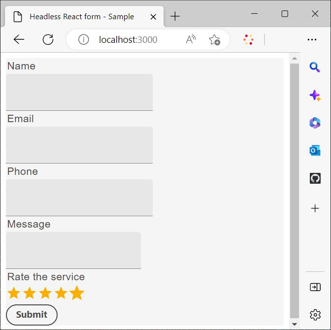
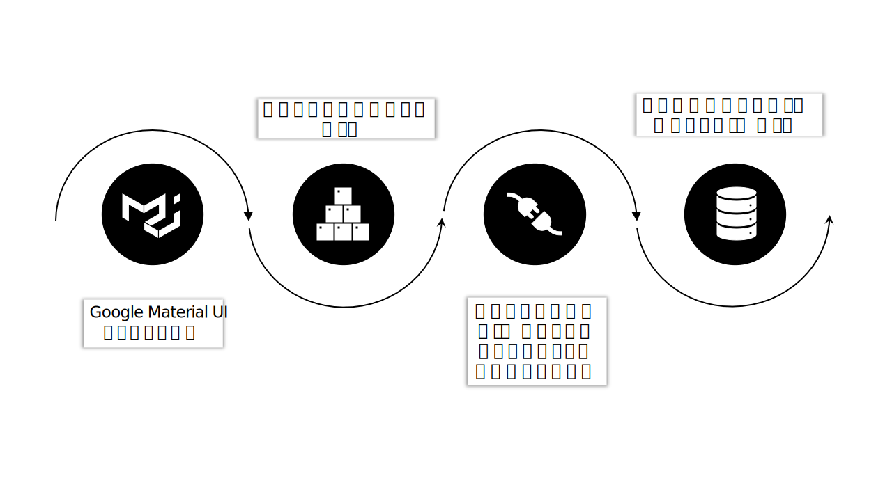
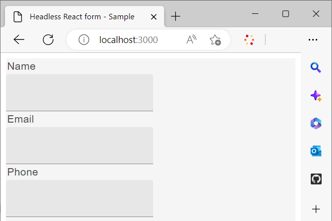

# カスタム React ライブラリを使用したヘッドレスフォームのレンダリング

カスタムコンポーネントを作成および実装して、組織の要件やガイドラインに従ってヘッドレスアダプティブフォームの外観と機能（動作）をカスタマイズできます。

これらのコンポーネントは、フォームフィールドの外観やスタイルを制御し、これらのフィールドを通じて収集されたデータをフォームモデルインスタンス内に保存するという 2 つの主な目的を果たします。 これが混乱のように聞こえる場合は、心配しないでください。近日中にこれらの目的を詳しく検討します。 ここでは、カスタムコンポーネントを作成し、これらのコンポーネントを使用してフォームをレンダリングし、イベントを使用してデータを保存して REST エンドポイントに送信する最初の手順に焦点を当てます。

このチュートリアルでは、Google Material UI コンポーネントを使用して、カスタム React コンポーネントを使用してヘッドレスアダプティブフォームをレンダリングする方法を示します。 ただし、このライブラリに限定されず、任意の React コンポーネントライブラリを自由に利用したり、独自のカスタムコンポーネントを開発したりできます。

この記事の結論では、 _お問い合わせ_ 次で作成されたフォーム： [スターターキットを使用したヘッドレスフォームの作成と公開](create-and-publish-a-headless-form.md) 記事は、次のように変換されます。




Google Material UI コンポーネントを使用してフォームをレンダリングする主な手順は次のとおりです。



## 1. Google Material UI のインストール

デフォルトでは、スターターキットは [Adobeスペクトル](https://spectrum.adobe.com/) コンポーネント。 次に、使用するように設定します [Google Material UI](https://mui.com/):

1. スターターキットが動作していないことを確認します。 スターターキットを停止するには、ターミナルを開き、 **react-starter-kit-aem-headless-forms**&#x200B;をクリックし、Ctrl + C キーを押します (Windows、Mac、Linux でも同じです )。

   ターミナルを閉じようとしないでください。 ターミナルを閉じても、スターターキットは停止しません。

1. 次のコマンドを実行します。

```shell
    
    npm install @mui/material @emotion/react @emotion/styled --force
    
```

Google Material UI npm ライブラリがインストールされ、スターターキットの依存関係にライブラリが追加されます。 これで、マテリアル UI コンポーネントを使用して、フォームコンポーネントをレンダリングできるようになりました。


## 2.カスタム React コンポーネントを作成する

デフォルトを置き換えるカスタムコンポーネントを作成しましょう [テキスト入力](https://spectrum.adobe.com/page/text-field/) コンポーネント [Google Material UI テキストフィールド](https://mui.com/material-ui/react-text-field/) コンポーネント。

コンポーネントタイプ ([fieldType](https://opensource.adobe.com/aem-forms-af-runtime/storybook/?path=/story/reference-json-properties-fieldtype--text-input) または：type) は、ヘッドレスフォーム定義で使用されます。 例えば、前のセクションで作成した「連絡先」フォームでは、「名前」、「電子メール」、「電話」の各フィールドのタイプが `text-input` ([fieldType: &quot;text-input&quot;](https://opensource.adobe.com/aem-forms-af-runtime/storybook/?path=/docs/adaptive-form-components-text-input-field--def)) の場合、メッセージフィールドのタイプは `multiline-input` ([&quot;fieldType&quot;: &quot;multiline-input&quot;](https://opensource.adobe.com/aem-forms-af-runtime/storybook/?path=/docs/reference-json-properties-fieldtype--multiline-input)) をクリックします。


カスタムコンポーネントを作成して、 [fieldType: &quot;text-input&quot;](https://opensource.adobe.com/aem-forms-af-runtime/storybook/?path=/docs/adaptive-form-components-text-input-field--def) プロパティ： [マテリアル UI テキストフィールド](https://mui.com/material-ui/react-text-field/) コンポーネント。


カスタムコンポーネントを作成し、カスタムコンポーネントを [fieldType](https://opensource.adobe.com/aem-forms-af-runtime/storybook/?path=/docs/adaptive-form-components-text-input-field--def) プロパティ：

1. を開きます。 **react-starter-kit-aem-headless-forms** コードエディターのディレクトリに移動し、に移動します。 `\react-starter-kit-aem-headless-forms\src\components`.


1. のコピーを作成 **スライダー** または **richtext** フォルダを開き、コピーしたフォルダの名前をに変更します。 **materialtextfield**. スライダーとリッチテキストは、スターターアプリで使用できる 2 つのサンプルカスタムコンポーネントです。 これらを使用して、独自のカスタムコンポーネントを作成できます。

   

1. を開きます。 `\react-starter-kit-aem-headless-forms\src\components\materialtextfield\index.tsx` ファイルを開き、既存のコードを以下のコードに置き換えます。 このコードは、 [Google Material UI テキストフィールド](https://mui.com/material-ui/react-text-field/) コンポーネント。

```JavaScript
 
     import React from 'react';
     import {useRuleEngine} from '@aemforms/af-react-renderer';
     import {FieldJson, State} from '@aemforms/af-core';
     import { TextField } from '@mui/material';
     import Box from '@mui/material/Box';
     import { richTextString } from '@aemforms/af-react-components';
     import Typography from '@mui/material/Typography';


     const MaterialtextField = function (props: State<FieldJson>) {

         const [state, handlers] = useRuleEngine(props);

         return(

         <Box>
             <Typography component="legend">{state.visible ? richTextString(state?.label?.value): ""} </Typography>
             <TextField variant="filled"/>
         </Box>

         )
     }

     export default MaterialtextField;
```


The `state.visible` 部品は、コンポーネントが表示されるように設定されているかどうかをチェックします。 その場合、フィールドのラベルは、 `richTextString(state?.label?.value)`.


カスタムコンポーネント `materialtextfield` の準備が整いました。 このカスタムコンポーネントを設定して、  [fieldType: &quot;text-input&quot;](https://opensource.adobe.com/aem-forms-af-runtime/storybook/?path=/docs/adaptive-form-components-text-input-field--def) Google Material UI のテキストフィールド

## 3.ヘッドレスフォームフィールドにカスタムコンポーネントをマッピングする

サードパーティのライブラリコンポーネントを使用してフォームフィールドをレンダリングするプロセスは、マッピングと呼ばれます。 各 ([fieldType](https://opensource.adobe.com/aem-forms-af-runtime/storybook/?path=/story/reference-json-properties-fieldtype--text-input)) をサードパーティライブラリの対応するコンポーネントに追加する必要があります。

すべてのマッピング関連情報が `mappings.ts` ファイル。 The `...mappings` 内の文 `mappings.ts` ファイルは、デフォルトのマッピングを参照し、[fieldType](https://opensource.adobe.com/aem-forms-af-runtime/storybook/?path=/story/reference-json-properties-fieldtype--text-input) または：type) [Adobeスペクトル](https://spectrum.adobe.com/page/text-field/) コンポーネント。

のマッピングを追加するには、以下を実行します。  `materialtextfield` コンポーネント：最後の手順で作成しました：

1. `mappings.ts` ファイルを開きます。

1. 次の import 文を追加して、 `materialtextfield` コンポーネントを `mappings.ts` ファイル：


   ```JavaScript
       import MaterialtextField from "../components/materialtextfield";
   ```

1. 次の文を追加して、 `text-input` materialtextfield コンポーネントを使用します。


   ```JavaScript
       "text-input": MaterialtextField
   ```

   ファイルの最終的なコードは次のようになります。

   ```JavaScript
         import { mappings } from "@aemforms/af-react-components";
         import MaterialtextField from "../components/materialtextfield";
   
   
         const customMappings: any = {
           ...mappings,
           "text-input": MaterialtextField
        };
        export default customMappings;
   ```

1. アプリを保存して実行します。 フォームの最初の 3 つのフィールドは、 [Google Material UI テキストフィールド](https://mui.com/material-ui/react-text-field/):

   


   同様に、メッセージ (「fieldType」:「multiline-input」) のカスタムコンポーネントを作成し、サービス (「fieldType」:「number-input」) フィールドを評価できます。 次の Git リポジトリをメッセージのカスタムコンポーネント用に複製し、サービスフィールドを評価することができます。

   [https://github.com/singhkh/react-starter-kit-aem-headless-forms](https://github.com/singhkh/react-starter-kit-aem-headless-forms)

## 次の手順

これで、Google Material UI を使用するカスタムコンポーネントを含むフォームが正常にレンダリングされました。 ( 対応するGoogle Material UI コンポーネントにマッピングされた ) 送信ボタンをクリックしてフォームを送信しようとしましたか？ そうでない場合は、先に行って、試してみてください。

フォームはデータを任意のデータソースに送信しますか？ いいえ? 心配しないで。 これは、フォームがランタイムライブラリと通信するように設定されていないためです。

フォームとの通信を設定する方法を教えてください。 すべてを詳しく説明する記事が近日公開されます。 お待ちください！
